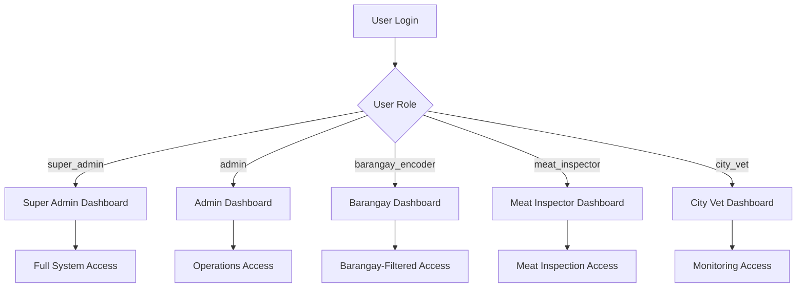

# Role-Based Access Control (RBAC) Implementation Plan

## Overview

This document outlines the implementation plan for the 5-role system based on user requirements.

## Role Mapping

| Requested Role | System Role | Access Level |
|---------------|-------------|---------------|
| Super Admin | `super_admin` | Full System Control |
| Admin | `admin` | Operations Management |
| Barangay User | `barangay_encoder` | Barangay-Filtered |
| Meat Inspector | `meat_inspector` | Meat Inspection Only |
| City Vet / Office Head | `city_vet` | Monitoring & Analytics |

---

## Detailed Permissions Matrix

### 1. Super Admin

**Route Prefix:** `/super-admin`

| Module | Access | Actions |
|--------|--------|---------|
| Dashboard | ✅ Full | View KPIs, Recent Activities, Bite Map |
| User Management | ✅ Full | Create/Update/Deactivate, Assign Roles |
| Roles Management | ✅ Full | Manage all roles |
| Barangays | ✅ Full | Master list CRUD |
| Clients | ✅ Full | View All |
| Animals | ✅ Full | View All |
| Bite Incidents | ✅ Full | View/Update All |
| Follow-ups | ✅ Full | View/Update All |
| Impounds | ✅ Full | View/Update All |
| Meat Establishments | ✅ Full | CRUD |
| Meat Inspections | ✅ Full | View All |
| Announcements | ✅ Full | CRUD |
| Reports & Analytics | ✅ Full | Generate/Export, View Map |
| System Logs | ✅ Full | View/Audit/Export |

**Landing Page:** System Overview Dashboard
- KPI Cards: Total Clients, Total Animals, Open Bite Cases, Impounded Animals, Establishments, Inspections
- Recent Activities (latest updates)
- Bite Case Map Preview (barangay hotspots)
- Quick Links to manage users and logs

---

### 2. Admin

**Route Prefix:** `/admin`

| Module | Access | Actions |
|--------|--------|---------|
| Dashboard | ✅ Full | View All KPIs |
| User Management | ⚠️ Limited | Manage staff (NOT super_admin) |
| Clients | ✅ Full | View/Manage |
| Animals | ✅ Full | View/Manage |
| Bite Incidents | ✅ Full | Encode/Update |
| Follow-ups | ✅ Full | Encode/Update |
| Impounds | ✅ Full | Encode/Update |
| Meat Establishments | ✅ Optional | Based on policy |
| Meat Inspections | ✅ Optional | Based on policy |
| Announcements | ✅ Full | Post |
| Reports & Analytics | ✅ Full | Generate (no audit) |
| System Logs | ❌ Restricted | Usually restricted |
| Roles Management | ❌ Restricted | Usually restricted |

**Admin Boundary Rule:**
- Can create/edit users **except** super_admin
- Cannot change someone's role to super_admin
- Cannot access roles management page

**Landing Page:** Operations Dashboard
- KPI Cards: Open Bite Cases, New Reports Today, Impounded Animals, Inspections (Passed/Failed)
- Recent Bite Cases Table
- Recent Impounds Table
- Reports Shortcuts (daily/weekly/monthly)

---

### 3. Barangay User

**Route Prefix:** `/barangay`

| Module | Access | Actions |
|--------|--------|---------|
| Dashboard | ✅ Filtered | Barangay-only view (by barangay_id) |
| Clients | ❌ Restricted | Global only |
| Animals | ❌ Restricted | Global only |
| Bite Incidents | ✅ Filtered | Encode (assigned barangay only) |
| Follow-ups | ✅ Filtered | Add/Update (assigned barangay) |
| Impounds | ❌ No Access | - |
| Meat Inspection | ❌ No Access | - |
| Reports | ✅ Filtered | Barangay-only reports/map |
| Announcements | 👁️ View | View only |
| Users/Roles | ❌ No Access | - |
| System Logs | ❌ No Access | - |

**Barangay Filter Rule:**
- All queries filtered by `$user->barangay_id`
- Enforced at query level and policy layer

**Landing Page:** Barangay Dashboard
- KPI Cards: Bite Cases in Their Barangay (Open/Closed), Follow-ups Due
- List of Latest Bite Incidents (barangay only)
- Quick "Add Bite Report" Button

---

### 4. Meat Inspector

**Route Prefix:** `/meat-inspection`

| Module | Access | Actions |
|--------|--------|---------|
| Dashboard | ✅ Inspection Only | KPIs specific to meat inspection |
| Meat Establishments | ✅ Full | Register (if allowed) |
| Meat Inspections | ✅ Full | Encode, Update, Results |
| Reports | ✅ Inspection Only | Inspection summaries |
| Announcements | 👁️ View | View only |
| Bite Monitoring | ❌ No Access | - |
| Impounds | ❌ No Access | - |
| Users/Roles | ❌ No Access | - |
| System Logs | ❌ No Access | - |

**Landing Page:** Meat Inspection Dashboard
- KPI Cards: Total Establishments, Inspections This Month, Passed, Failed, Conditional
- List of Scheduled/Recent Inspections
- Quick "Add Inspection" Button

---

### 5. City Vet / Office Head

**Route Prefix:** `/city-vet`

| Module | Access | Actions |
|--------|--------|---------|
| Dashboard | ✅ Monitoring | System-wide view |
| Bite Incidents | 👁️ View | Review/Validate (view-only) |
| Follow-ups | 👁️ View | Monitor trends (view-only) |
| Reports & Analytics | ✅ Full | Generate, View Map |
| Impounds | 👁️ View | View-only summary |
| Inspections | 👁️ View | View-only summary |
| Announcements | 👁️ View | View only |
| Users/Roles | ⚠️ Optional | Unless allowed |
| System Logs | ⚠️ Optional | Unless allowed |

**Landing Page:** Monitoring Dashboard
- KPI Cards: Open Bite Cases, High Severity Cases, Barangay Rankings
- Map with Filters (date range, status, barangay)
- High-Risk Barangay List

---

## Implementation Tasks

### Phase 1: Database & Model Updates

- [ ] 1.1 **Migrate from text columns to FK columns**
  - The users table has BOTH old (`role`, `barangay` text) AND new (`role_id`, `barangay_id` FK) columns
  - Create migration to: Drop old `role` enum column, Drop old `barangay` column
  - Keep new `role_id` (FK to roles), `barangay_id` (FK to barangays), `status`
- [ ] 1.2 **Backfill role_id** from existing role values in users table
- [ ] 1.3 **Update User Model** to use `role_id` instead of text-based `role`
- [ ] 1.4 **Seed roles table** with 5 core roles

### Phase 2: Update Dashboard Controllers

- [ ] 2.1 Update `SuperAdminController` - Add KPI data for total clients, animals, bite cases, impounds, establishments, inspections
- [ ] 2.2 Update `AdminController` - Add KPIs for operations: open bite cases, new reports today, impounded animals, inspections
- [ ] 2.3 Update `BarangayController` - Filter all data by user's barangay_id, add KPI cards
- [ ] 2.4 Update `MeatInspectionController` - Add KPIs for establishments, inspections, pass/fail rates
- [ ] 2.5 Update `CityVetController` - Add monitoring KPIs, barangay rankings, high-risk areas

### Phase 3: Route Middleware & Policies

- [ ] 3.1 Add middleware per route group: `role:super_admin`, `role:admin`, `role:barangay_encoder`, `role:meat_inspector`, `role:city_vet`
- [ ] 3.2 Create **Policies** for record-level security:
  - `BarangayFilterPolicy`: Filter all queries by `$user->barangay_id`
  - `UserPolicy`: Admin cannot manage super_admin users
- [ ] 3.3 **System Logs**: Use `nullOnDelete()` for user_id (logs should remain if user deleted)

### Phase 4: Auth & UI

- [ ] 4.1 Update AuthController to redirect based on role_id
- [ ] 4.2 Hide restricted sidebar menu items per role
- [ ] 4.3 Add role labels in UI (e.g., "Barangay User (Encoder)")

---

## Database Schema Status

**Current State:**
- Base migration `0001_01_01_000000_create_users_table.php` has:
  - `role` (enum text column)
  - `barangay` (string text column)
- New migration `2026_02_21_000001` adds:
  - `role_id` (FK to roles)
  - `barangay_id` (FK to barangays)
  - `status` (active/inactive)

**Required Fix:**
- Drop old `role` enum column (keep role_id FK)
- Drop old `barangay` string column (keep barangay_id FK)
- Backfill role_id from existing role values

---

## Role Naming Convention

| Internal Code | Display Label |
|--------------|---------------|
| `super_admin` | Super Administrator |
| `admin` | Veterinary Administrator |
| `barangay_encoder` | Barangay User (Encoder) |
| `meat_inspector` | Meat Inspector |
| `city_vet` | City Veterinarian / Office Head |

---

## Mermaid: Role Access Flow

---

## Security Enforcement Layers

| Layer | Purpose |
|-------|---------|
| Route Middleware | Prevent access to wrong portal URL |
| Policies | Record-level filtering (barangay_id) |
| Query Scopes | Automatic filtering in models |
| UI Sidebar | Hide unauthorized menu items |

---

**Created:** 2026-02-21
**Status:** Ready for Implementation
